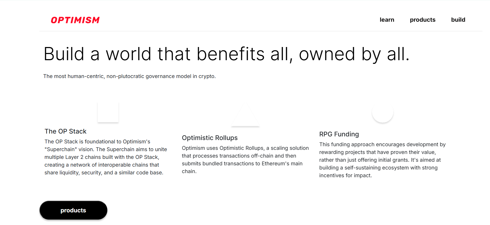

# PROJECT1 - OPTYMISM

# Optimism Oveview

Optimism is a cryptocurrency project designed to scale blockchain technology. The first implementation of blockchain technology was introduced with Bitcoin, which brought a decentralized currency that is trustless, transparent, and resistant to manipulation. This groundbreaking idea quickly gained traction among programmers, inspiring the concept of a decentralized internet where data is stored across a network of nodes rather than relying on a centralized server. This decentralized approach promotes fairness and removes single points of control.
The vision of a decentralized internet was first realized by Vitalik Buterin, who created Ethereum—the first blockchain to support decentralized applications (dApps). Optimism aims to scale Ethereum by providing a solution that makes transactions cheaper and faster.
Currently, the Optimism website is complex and challenging to navigate. My goal is to simplify it for better user experience and accessibility.
    

## Who is this for?  
- **Developers**: Building dApps on Ethereum using Layer 2 solutions.  
- **Crypto Enthusiasts/Investors**: Learning about Optimism and exploring investment opportunities.  
- **Existing Projects & DAOs**: Teams evaluating scalable and affordable Ethereum-based solutions.  
- **Researchers/Analysts**: Studying Layer 2 technology and Ethereum scaling.  

## Main Goal  
To provide clear educational content and technical resources, catering to both beginners and developers as crypto concepts are still new to many.  


## Project Description
This project is a modern webpage built with HTML, CSS, and Bootstrap. Initially, the website featured a gradient-styled layout and a **Subscribe Section** where users could input their email addresses to subscribe for updates. To improve usability, I made the website **responsive**, using **Bootstrap components** to make it mobile-friendly and accessible on all screen sizes. The gradient background and subscribe button were removed to simplify the design, and the website was deployed to GitHub Pages.

## UX Development
- **Figma**: The user experience design for this project was created using [Figma](https://www.figma.com/). You can view the design stages, including the prototypes and development process, by following the link below:

[View UX Development on Figma](https://www.figma.com/design/IukzHed7QcjJxfFP36iGhH/OPTYMISM?node-id=3-8&t=jNUKA3Q6i1dhHlS5-1)

This design process helped shape the final implementation and layout of the website.

## Changes Made
- **Responsive Design**: The website was transformed to be fully responsive using Bootstrap components to ensure it works seamlessly across all devices (desktops, tablets, and mobile phones).
- **Removal of Gradient Backgrounds**: I removed the gradient-styled background from various sections of the site to create a cleaner, more modern look.
- **Removal of Subscribe Button**: The subscription form was removed to simplify the site and improve user experience.
- **GitHub Deployment**: The website was deployed to GitHub Pages, allowing users to access it live.

## Final Design Preview
This is the final design as conceptualized in Figma (after the changes were implemented):


## Final Project Screenshots

### New Website (After Updates)
These screenshots show how the website looks after the responsive design updates and simplifications:

#### Hero-section (New Version)


#### Products-section (New Version)


#### Build-section (New Version)


## Features
- **Navigation Bar**: A header with a logo on the left and navigation buttons on the right linking to different sections of the Landing Page.
- **Hero Section**: An introduction to the topic with a styled heading and paragraph.
- **Responsive Layout**: The layout is now fully responsive, adjusting to various screen sizes using Bootstrap components.
- **Products Section**: Cards displaying key features or topics.
- **Footer**: A footer with basic information.

## Technologies Used
- **HTML**: Structure of the webpage.
- **CSS**: Styling for layout, colors, fonts, and responsiveness.
- **Bootstrap**: For responsiveness and mobile-friendly layout.
- **Google Fonts**: Inter font for clean typography.
- **Box Shadows**: To enhance the design's appeal.
- **GitHub Pages**: Deployment platform for hosting the website live.

## Tools and Methodology
- **Designed in Figma**: This project utilized Figma to design the user interface and generate initial CSS code snippets. Figma’s design-to-code feature was instrumental in creating the layout and visual styles. These generated styles were further customized to fit the specific needs of the project.
- **Bootstrap**: Bootstrap was used to make the design responsive, using its grid system, utility classes, and pre-built components.

## Credits 
- **Optymism Logo**:  Logo OPTYMISM.png
- **Google Fonts**: Inter font for clean typography.
- **Box Shadows and Gradients**: To enhance the design's appeal.
- **Mosh Hamedani**:  This project incorporates code snippets and ideas inspired by the tutorial The Ultimate HTML5 & CSS3 Series: Part 3 by Mosh Hamedani. Mosh's comprehensive explanations and coding best practices significantly helped in structuring and styling this project.
- **Figma**:  This project incorporates svg code snippets from Figma for Ellipse and Triangle images used in Cards.

# File Path Testing

Here are 5 different file paths 

| **Path Example**                                    | **Explanation**                                                       | **Test Result (Pass/Fail)** |
|-----------------------------------------------------|-----------------------------------------------------------------------|----------------------------|
| Clicking a 'learn' link in the navbar               | Directed to the Learn Hero Section                                    | Pass                       |
| Clicking a 'products' link in the navbar            | Directed to the Products Section                                      | Pass                       |
| Clicking a 'build' link in the navbar               | Directed to the Build Section                                         | Pass                       |
| Clicking a 'learn' button in the hero section       | Directed to the learn.html page                                       | Pass                       |
| Clicking a 'products' btn in the products section   | Directed to the video.html page                                       | Pass                       |
| Clicking a 'build' button in the build section      | Directed to the hello.html page                                       | Pass                       |

---

## Summary of Errors and Fixes

### Errors pointed by a Validator

- **Error 1 Message:**
Error: Bad value assets/images/Logo OPTIMISM.png for attribute src on element img: Illegal character in path segment: space is not allowed.

From line 25, column 9; to line 25, column 71


 - **Error 2 Message:** 
Error: Bad value assets\pages\learn.html for attribute href on element a: Backslash ("\") used as path segment delimiter.

From line 46, column 13; to line 46, column 62
 

 - **Error 3 Message:** 
Error: The element button must not appear as a descendant of the a element.

From line 47, column 15; to line 47, column 45


 - **Error 4 Message:** 
Error: Bad value assets\pages\hello.html for attribute href on element a: Backslash ("\") used as path segment delimiter.

From line 136, column 3; to line 136, column 52


 - **Error 5 Message:** 
Error: The element button must not appear as a descendant of the a element.

From line 137, column 5; to line 137, column 35


- **Error 6 Message:** 
Error: Bad value assets\pages\hello.html for attribute href on element a: Backslash ("\") used as path segment delimiter.

From line 147, column 13; to line 147, column 62
  

- **Error 7 Message:** 
Error: The element button must not appear as a descendant of the a element.

From line 148, column 15; to line 148, column 45


## How to Run
1. Clone this repository to your local machine:
   ```bash
   git clone https://github.com/maggku/Project1-Optymism.git

## Deployed Version

   - **Live Version**: You can view the live website at [GitHub Pages Link](https://maggku.github.io/Project1-Optymism/).


